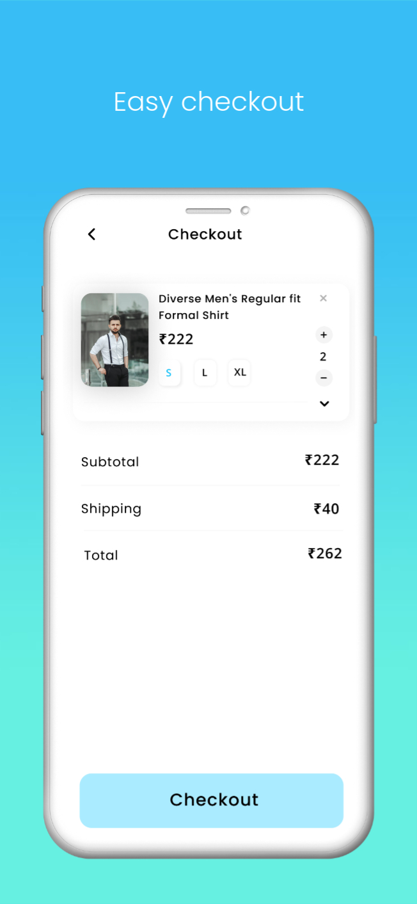
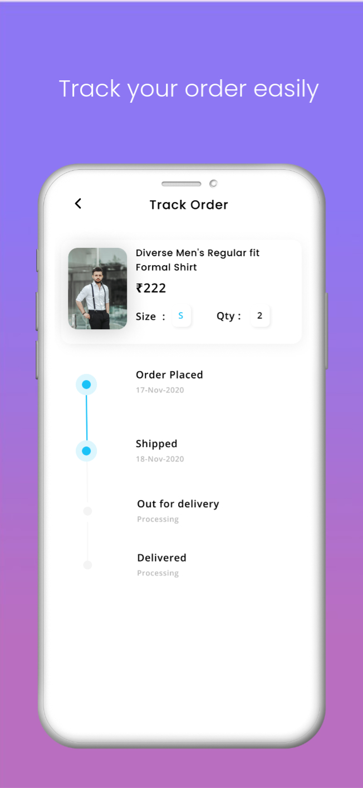
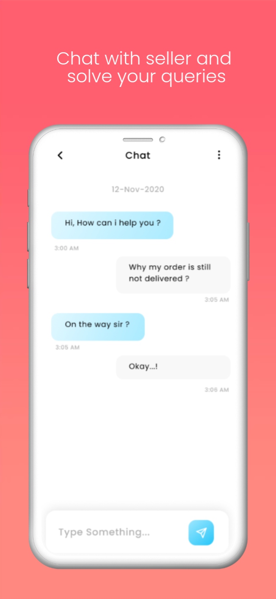
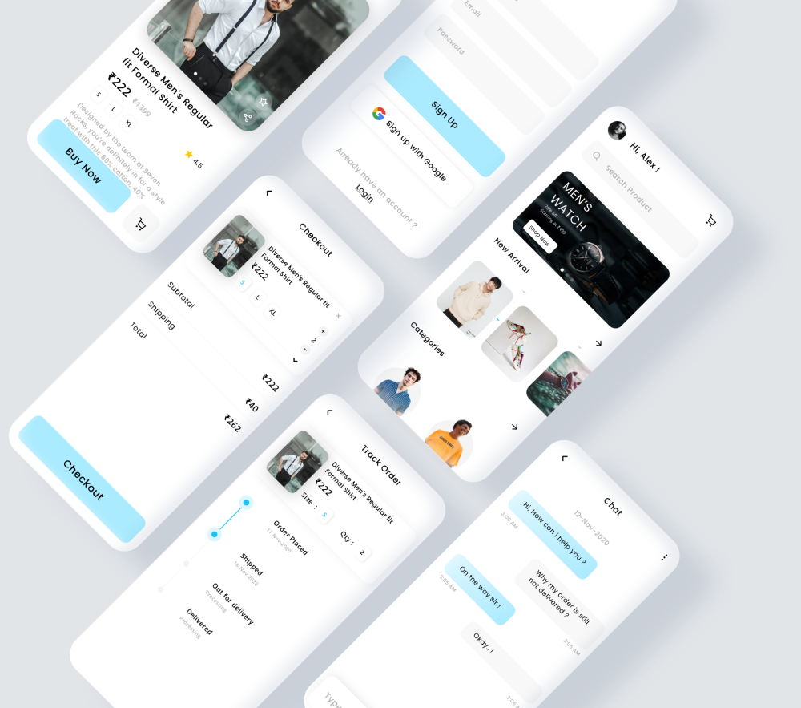

#Nineteenfive
<h3 style="font-size: 18px; letter-spacing: 1.2px">SCREEN SHOTS</h3>

    
    
    
    
    
 

<h3 style="font-size: 18px; letter-spacing: 1.2px">ABOUT US</h3>

    
Nineteenfive is India’s ultimate shopping destination for clothes. Forget visiting local shop or crowed malls whenyou can get the latest fashion attire at your doorstep. For those who love fashion and dress up to look stunning in their attire when they step out in any season, Nineteenfive is your answer.

<h3 style="font-size: 18px; letter-spacing: 1.2px">FEATURES</h3>
<ol style="font-size: 16px;color: rgb(124, 122, 122);letter-spacing: 0.8px;line-height: 1.5;">
    <li>Easy login & registration</li>   
    <li>User-friendly product filtering and sorting</li>   
    <li>Detailed product descriptions</li>   
    <li>Shopping cart</li>   
    <li>Shipping options</li>   
    <li>Order summary</li>   
    <li>Secure and easy in-app payments</li>   
    <li>Checking the shipping status</li>   
    <li>Returns and checking the return status</li>   
    <li>Liked products list</li>   
    <li>Flash sales and discounts</li>
    <li>Help & Support</li>
    <li>Direct chat with seller</li>
    <li>Product rating</li>
</ol>

